# Architecture Diagrams

## System Context Diagram

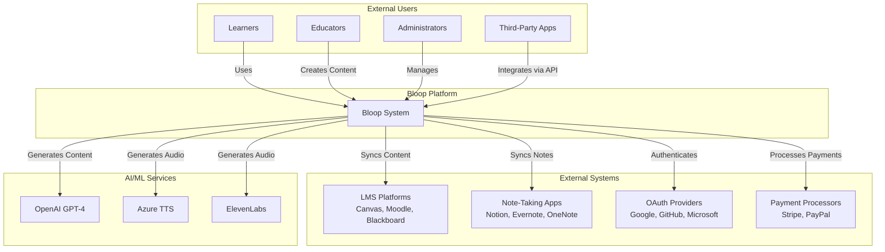

## Container Diagram

```mermaid
graph TB
    subgraph "Client Applications"
        WEB[Web Application<br/>React + TypeScript]
        MOBILE[Mobile App<br/>React Native]
        API_CLIENT[Third-Party Apps<br/>REST/GraphQL Clients]
    end
    
    subgraph "Edge Layer"
        CDN[CDN<br/>CloudFlare]
        LB[Load Balancer<br/>AWS ALB/NLB]
        APIGW[API Gateway<br/>Kong]
    end
    
    subgraph "Application Services"
        AUTH[Auth Service<br/>FastAPI]
        USER[User Service<br/>FastAPI]
        CONTENT[Content Service<br/>FastAPI]
        VIDEO[Video Service<br/>FastAPI]
        LEARN[Learning Service<br/>FastAPI]
        SOCIAL[Social Service<br/>FastAPI]
        ANALYTICS[Analytics Service<br/>FastAPI]
        NOTIF[Notification Service<br/>Node.js]
        REALTIME[Real-time Service<br/>Node.js + Socket.io]
        INTEGRATION[Integration Service<br/>FastAPI]
    end
    
    subgraph "AI/ML Services"
        LLM[LLM Service<br/>Python]
        TTS[TTS Service<br/>Python]
        MANIM[Manim Renderer<br/>Python]
        AVATAR[Avatar Generator<br/>Python + SadTalker]
        RECOMMEND[Recommendation Engine<br/>Python + ML]
    end
    
    subgraph "Data Stores"
        POSTGRES[(PostgreSQL<br/>User & Transactional Data)]
        MONGO[(MongoDB<br/>Content & Documents)]
        NEO4J[(Neo4j<br/>Relationships & Graphs)]
        INFLUX[(InfluxDB<br/>Time-Series Analytics)]
        REDIS[(Redis<br/>Cache & Sessions)]
        S3[(S3/Blob Storage<br/>Media Files)]
        ELASTIC[(Elasticsearch<br/>Search Index)]
    end
    
    subgraph "Message Infrastructure"
        KAFKA[Kafka<br/>Event Streaming]
        RABBITMQ[RabbitMQ<br/>Task Queue]
    end
    
    WEB --> CDN
    MOBILE --> LB
    API_CLIENT --> APIGW
    CDN --> APIGW
    LB --> APIGW
    
    APIGW --> AUTH
    APIGW --> USER
    APIGW --> CONTENT
    APIGW --> VIDEO
    APIGW --> LEARN
    APIGW --> SOCIAL
    APIGW --> ANALYTICS
    APIGW --> NOTIF
    APIGW --> REALTIME
    APIGW --> INTEGRATION
    
    VIDEO --> LLM
    VIDEO --> TTS
    VIDEO --> MANIM
    VIDEO --> AVATAR
    CONTENT --> LLM
    LEARN --> RECOMMEND
    
    AUTH --> POSTGRES
    USER --> POSTGRES
    USER --> REDIS
    CONTENT --> MONGO
    CONTENT --> S3
    CONTENT --> ELASTIC
    LEARN --> NEO4J
    SOCIAL --> NEO4J
    ANALYTICS --> INFLUX
    VIDEO --> S3
    REALTIME --> REDIS
    
    AUTH --> KAFKA
    CONTENT --> KAFKA
    LEARN --> KAFKA
    SOCIAL --> KAFKA
    VIDEO --> RABBITMQ
    NOTIF --> RABBITMQ
```

## Deployment Architecture

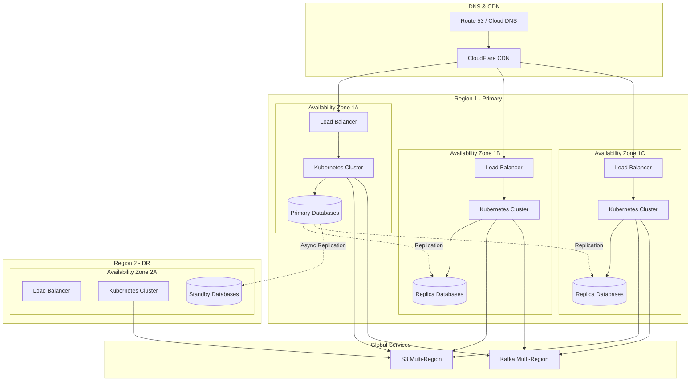

## Network Architecture

```mermaid
graph TB
    subgraph "Public Subnet"
        IGW[Internet Gateway]
        NAT[NAT Gateway]
        ALB[Application Load Balancer]
    end
    
    subgraph "Private Subnet - Application Tier"
        APIGW[API Gateway]
        AUTH[Auth Service Pods]
        USER[User Service Pods]
        CONTENT[Content Service Pods]
        VIDEO[Video Service Pods]
        LEARN[Learning Service Pods]
        SOCIAL[Social Service Pods]
    end
    
    subgraph "Private Subnet - AI/ML Tier"
        LLM[LLM Service Pods<br/>GPU Instances]
        TTS[TTS Service Pods]
        MANIM[Manim Renderer Pods<br/>GPU Instances]
        AVATAR[Avatar Generator Pods<br/>GPU Instances]
    end
    
    subgraph "Private Subnet - Data Tier"
        POSTGRES[(PostgreSQL<br/>RDS Multi-AZ)]
        MONGO[(MongoDB<br/>Atlas Cluster)]
        NEO4J[(Neo4j<br/>Aura)]
        REDIS[(Redis<br/>ElastiCache)]
    end
    
    subgraph "Private Subnet - Message Tier"
        KAFKA[Kafka Cluster<br/>MSK]
        RABBITMQ[RabbitMQ Cluster<br/>AmazonMQ)]
    end
    
    IGW --> ALB
    ALB --> APIGW
    
    APIGW --> AUTH
    APIGW --> USER
    APIGW --> CONTENT
    APIGW --> VIDEO
    APIGW --> LEARN
    APIGW --> SOCIAL
    
    VIDEO --> LLM
    VIDEO --> TTS
    VIDEO --> MANIM
    VIDEO --> AVATAR
    
    AUTH --> POSTGRES
    USER --> POSTGRES
    CONTENT --> MONGO
    LEARN --> NEO4J
    SOCIAL --> NEO4J
    
    AUTH --> REDIS
    USER --> REDIS
    
    AUTH --> KAFKA
    CONTENT --> KAFKA
    VIDEO --> RABBITMQ
    
    AUTH --> NAT
    VIDEO --> NAT
    LLM --> NAT
```

## Service Mesh Architecture

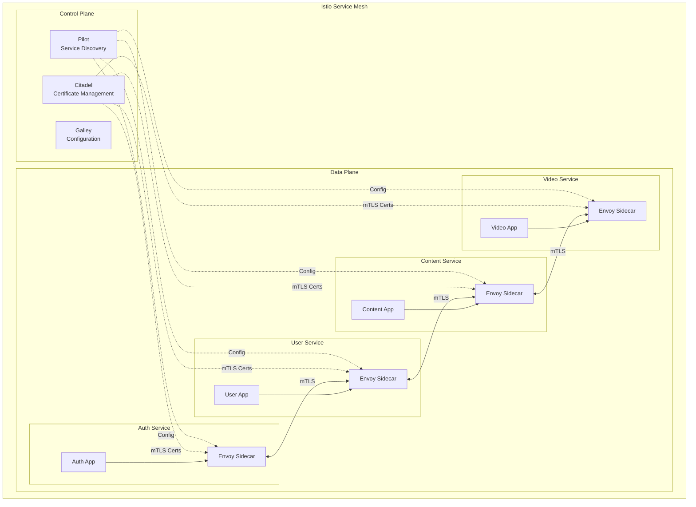

## Data Flow Architecture

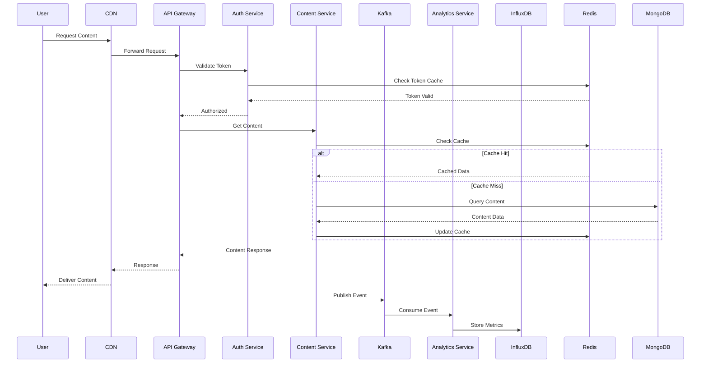


## Security Architecture

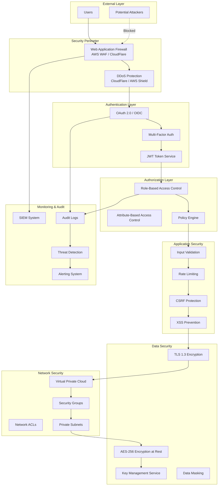

## Monitoring & Observability Architecture

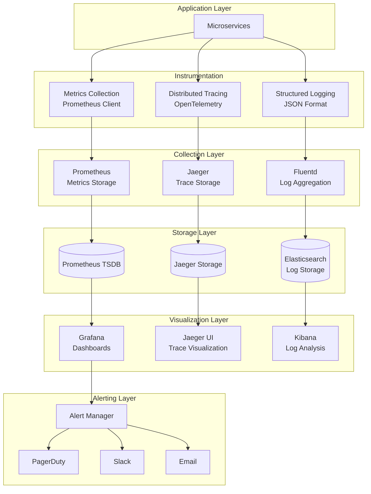

## CI/CD Pipeline Architecture

```mermaid
graph LR
    subgraph "Source Control"
        GIT[Git Repository<br/>GitHub/GitLab]
    end
    
    subgraph "CI Pipeline"
        TRIGGER[Webhook Trigger]
        BUILD[Build & Test]
        LINT[Lint & Format]
        UNIT[Unit Tests]
        PROPERTY[Property Tests]
        INTEGRATION[Integration Tests]
        SECURITY[Security Scan]
        COVERAGE[Coverage Report]
    end
    
    subgraph "Artifact Management"
        DOCKER_REG[Docker Registry<br/>ECR/GCR]
        HELM_REPO[Helm Repository]
    end
    
    subgraph "CD Pipeline"
        DEPLOY_DEV[Deploy to Dev]
        E2E_DEV[E2E Tests - Dev]
        DEPLOY_STAGING[Deploy to Staging]
        E2E_STAGING[E2E Tests - Staging]
        PERF_TEST[Performance Tests]
        APPROVAL[Manual Approval]
        DEPLOY_PROD[Deploy to Production]
        SMOKE_TEST[Smoke Tests]
        ROLLBACK[Rollback on Failure]
    end
    
    subgraph "Environments"
        DEV[Development<br/>Kubernetes]
        STAGING[Staging<br/>Kubernetes]
        PROD[Production<br/>Kubernetes]
    end
    
    GIT --> TRIGGER
    TRIGGER --> BUILD
    BUILD --> LINT
    LINT --> UNIT
    UNIT --> PROPERTY
    PROPERTY --> INTEGRATION
    INTEGRATION --> SECURITY
    SECURITY --> COVERAGE
    
    COVERAGE --> DOCKER_REG
    COVERAGE --> HELM_REPO
    
    DOCKER_REG --> DEPLOY_DEV
    DEPLOY_DEV --> DEV
    DEV --> E2E_DEV
    
    E2E_DEV --> DEPLOY_STAGING
    DEPLOY_STAGING --> STAGING
    STAGING --> E2E_STAGING
    E2E_STAGING --> PERF_TEST
    
    PERF_TEST --> APPROVAL
    APPROVAL --> DEPLOY_PROD
    DEPLOY_PROD --> PROD
    PROD --> SMOKE_TEST
    
    SMOKE_TEST -.->|Failure| ROLLBACK
    ROLLBACK -.-> PROD
```

## Disaster Recovery Architecture

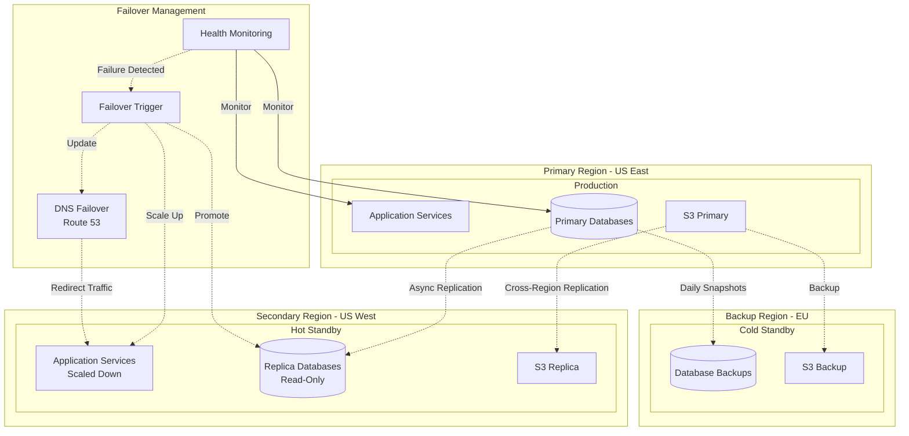

## Scaling Architecture

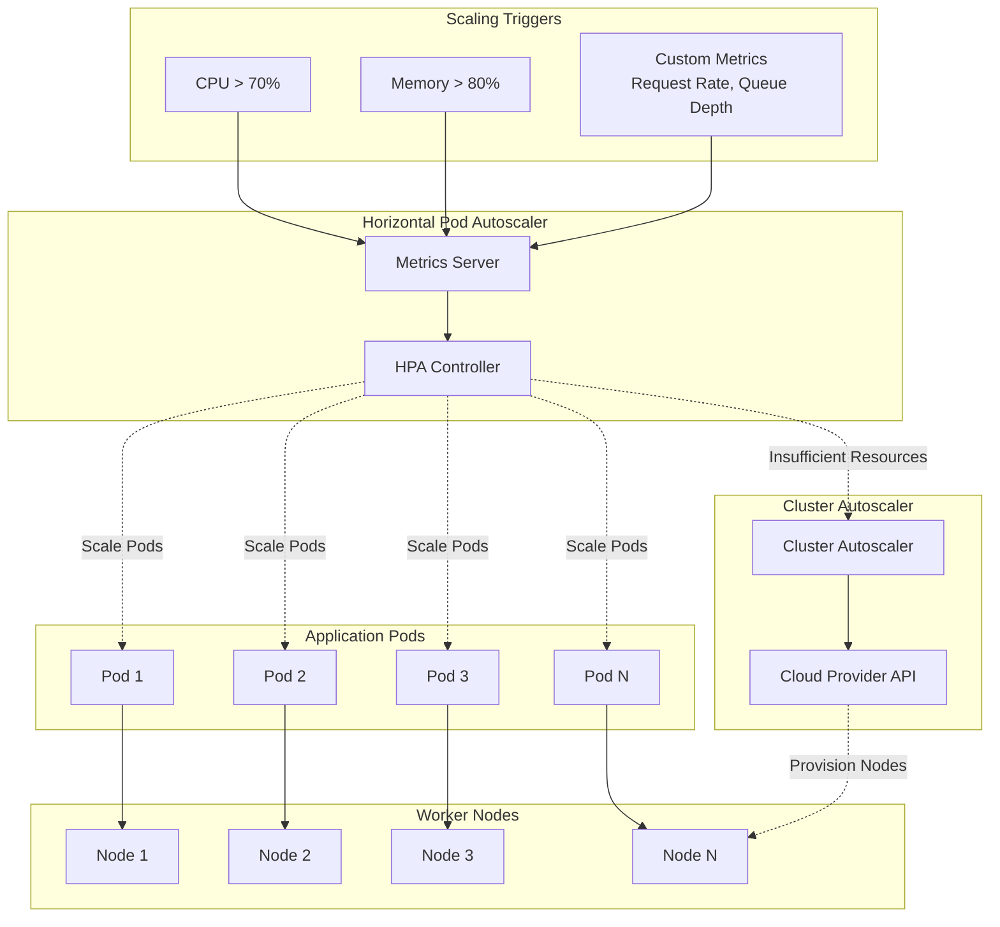

## Event-Driven Architecture

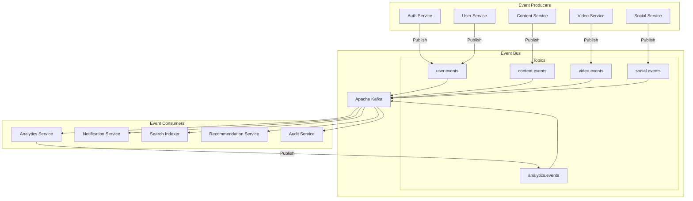

