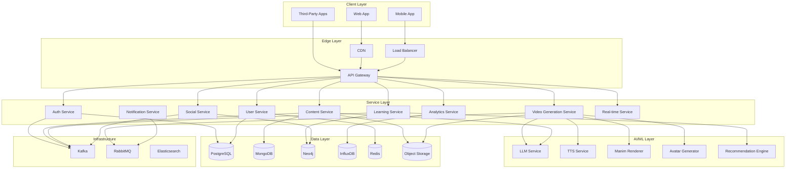

# Design Document

## Overview

This document presents a comprehensive design for Bloop 2.0, a complete architectural redesign and feature enhancement of the AI-powered educational learning platform. The design encompasses a modern, cloud-native microservices architecture built from scratch, along with extensive new features for collaboration, analytics, gamification, and social learning.

### Design Goals

1. **Scalability**: Support millions of concurrent users with horizontal scaling
2. **Performance**: Sub-second response times for most operations
3. **Reliability**: 99.9% uptime with fault tolerance and graceful degradation
4. **Extensibility**: Plugin architecture for easy feature additions
5. **Security**: Enterprise-grade security with data encryption and compliance
6. **Developer Experience**: Clean APIs and comprehensive documentation

### Technology Stack

**Backend Services:**
- **API Gateway**: Kong or AWS API Gateway
- **Service Framework**: FastAPI (Python), Node.js (TypeScript) for real-time services
- **Message Queue**: Apache Kafka for event streaming, RabbitMQ for task queues
- **Service Mesh**: Istio for service-to-service communication
- **Container Orchestration**: Kubernetes (EKS, GKE, or AKS)

**Databases:**
- **Relational**: PostgreSQL for transactional data
- **Document**: MongoDB for flexible content storage
- **Graph**: Neo4j for relationships and learning paths
- **Time-Series**: InfluxDB for analytics and metrics
- **Cache**: Redis for distributed caching and session management
- **Object Storage**: AWS S3 / Azure Blob / GCS for media files

**AI/ML Infrastructure:**
- **LLM**: OpenAI GPT-4, Azure OpenAI, or self-hosted models
- **TTS**: Azure Speech Services, ElevenLabs
- **Animation**: Manim Community Edition
- **Avatar**: SadTalker or similar
- **ML Platform**: Kubeflow or AWS SageMaker for model training/deployment

**Frontend:**
- **Web**: React with TypeScript, Next.js for SSR
- **Mobile**: React Native for cross-platform mobile apps
- **State Management**: Redux Toolkit or Zustand
- **Real-time**: Socket.io client

**DevOps & Infrastructure:**
- **CI/CD**: GitHub Actions, GitLab CI, or Jenkins
- **Monitoring**: Prometheus + Grafana
- **Logging**: ELK Stack (Elasticsearch, Logstash, Kibana)
- **Tracing**: Jaeger or Zipkin
- **CDN**: CloudFlare or AWS CloudFront


## Architecture

### High-Level Architecture



### Microservices Architecture

#### Core Services

**1. Authentication Service**
- Handles user authentication and authorization
- Implements OAuth 2.0, OpenID Connect
- Manages JWT tokens with refresh token rotation
- Integrates with social login providers
- Rate limiting and brute force protection

**2. User Service**
- User profile management
- Preferences and settings
- Achievement and certification tracking
- User relationships (followers, following)
- Privacy settings management

**3. Content Service**
- Content CRUD operations (videos, flashcards, quizzes)
- Content versioning and history
- Content search and discovery
- Content rating and reviews
- Content recommendation integration

**4. Video Generation Service**
- Orchestrates video generation pipeline
- Scene planning with LLM
- Manim code generation and rendering
- TTS generation and synchronization
- Avatar generation and composition
- Error handling and retry logic

**5. Learning Service**
- Roadmap generation and management
- Progress tracking across all content types
- Spaced repetition scheduling
- Learning analytics computation
- Milestone and achievement logic

**6. Social Service**
- Study group management
- Real-time collaboration sessions
- Activity feed generation
- User interactions (likes, comments, shares)
- Leaderboard computation

**7. Analytics Service**
- Event ingestion and processing
- Metrics aggregation and computation
- Dashboard data generation
- Predictive analytics
- Export and reporting

**8. Notification Service**
- Multi-channel notifications (email, push, in-app)
- Notification preferences management
- Template management
- Delivery tracking and retry logic

**9. Real-time Service**
- WebSocket connection management
- Presence tracking
- Real-time event broadcasting
- Collaborative session synchronization

**10. Integration Service**
- LMS integration (Canvas, Moodle, Blackboard)
- Note-taking app integration (Notion, Evernote, OneNote)
- OAuth flow management for integrations
- Data synchronization and webhooks


### Service Communication Patterns

**Synchronous Communication:**
- REST APIs for request-response patterns
- gRPC for high-performance service-to-service calls
- GraphQL for flexible client queries

**Asynchronous Communication:**
- Kafka for event streaming and event sourcing
- RabbitMQ for task queues and job processing
- Pub-sub pattern for real-time updates

**Communication Flow Examples:**

1. **Video Generation Flow:**
```
Client → API Gateway → Video Service → [Publish to Queue]
                                      ↓
                        Video Worker → LLM Service → TTS Service → Manim Service
                                      ↓
                        [Publish Event] → Notification Service → Client (WebSocket)
```

2. **Social Interaction Flow:**
```
Client → API Gateway → Social Service → [Publish Event to Kafka]
                                       ↓
                        Event Consumers: Analytics, Notification, Feed Generator
```

### Data Architecture

#### Database Selection Rationale

**PostgreSQL (Relational):**
- User accounts and authentication
- Enrollments and subscriptions
- Transactions and billing
- Strong ACID guarantees needed

**MongoDB (Document):**
- Content metadata (videos, flashcards, quizzes)
- User-generated content
- Flexible schema for evolving content types
- Fast reads for content discovery

**Neo4j (Graph):**
- User relationships (followers, study groups)
- Learning path dependencies
- Content relationships and recommendations
- Efficient traversal queries

**InfluxDB (Time-Series):**
- User activity events
- Performance metrics
- Learning progress over time
- Efficient time-based queries and aggregations

**Redis (Cache):**
- Session management
- API response caching
- Rate limiting counters
- Real-time leaderboards
- Pub-sub for real-time features

**S3/Blob Storage (Object):**
- Generated videos
- User-uploaded images
- Avatar models
- Backup and archival

#### Data Consistency Strategy

**Strong Consistency:**
- User authentication and authorization
- Financial transactions
- Critical user data updates

**Eventual Consistency:**
- Social interactions (likes, follows)
- Analytics and metrics
- Content recommendations
- Activity feeds

**Consistency Patterns:**
- Saga pattern for distributed transactions
- Event sourcing for audit trails
- CQRS for read/write separation
- Optimistic locking for concurrent updates


## Components and Interfaces

### API Gateway

**Responsibilities:**
- Request routing to appropriate services
- Authentication and authorization enforcement
- Rate limiting and throttling
- Request/response transformation
- API versioning
- CORS handling

**Interface:**
```typescript
// REST API Endpoints
GET    /api/v1/users/{userId}
POST   /api/v1/auth/login
POST   /api/v1/content/videos/generate
GET    /api/v1/learning/roadmaps/{roadmapId}
POST   /api/v1/social/groups
WS     /api/v1/realtime/connect

// GraphQL Endpoint
POST   /api/v1/graphql
```

**Rate Limiting:**
- Anonymous: 100 requests/hour
- Authenticated: 1000 requests/hour
- Premium: 10000 requests/hour
- Burst allowance: 20 requests/second

### Authentication Service

**Interface:**
```typescript
interface AuthService {
  // Authentication
  login(credentials: LoginCredentials): Promise<AuthTokens>
  logout(refreshToken: string): Promise<void>
  refreshToken(refreshToken: string): Promise<AuthTokens>
  
  // OAuth
  initiateOAuth(provider: OAuthProvider): Promise<OAuthUrl>
  handleOAuthCallback(code: string, state: string): Promise<AuthTokens>
  
  // Token Management
  validateToken(accessToken: string): Promise<TokenPayload>
  revokeToken(token: string): Promise<void>
}

interface AuthTokens {
  accessToken: string      // JWT, expires in 15 minutes
  refreshToken: string     // Opaque token, expires in 30 days
  expiresIn: number
  tokenType: 'Bearer'
}

interface TokenPayload {
  userId: string
  email: string
  roles: string[]
  permissions: string[]
  iat: number
  exp: number
}
```

**Security Features:**
- Argon2 password hashing
- JWT with RS256 signing
- Refresh token rotation
- Device fingerprinting
- Suspicious activity detection

### User Service

**Interface:**
```typescript
interface UserService {
  // Profile Management
  getProfile(userId: string): Promise<UserProfile>
  updateProfile(userId: string, updates: ProfileUpdates): Promise<UserProfile>
  deleteAccount(userId: string): Promise<void>
  
  // Preferences
  getPreferences(userId: string): Promise<UserPreferences>
  updatePreferences(userId: string, prefs: UserPreferences): Promise<void>
  
  // Achievements
  getAchievements(userId: string): Promise<Achievement[]>
  awardAchievement(userId: string, achievementId: string): Promise<void>
  
  // Relationships
  followUser(followerId: string, followeeId: string): Promise<void>
  unfollowUser(followerId: string, followeeId: string): Promise<void>
  getFollowers(userId: string, pagination: Pagination): Promise<User[]>
  getFollowing(userId: string, pagination: Pagination): Promise<User[]>
}

interface UserProfile {
  id: string
  email: string
  username: string
  displayName: string
  avatar: string
  bio: string
  learningGoals: string[]
  interests: string[]
  stats: UserStats
  createdAt: Date
  updatedAt: Date
}

interface UserStats {
  totalLearningTime: number
  contentCompleted: number
  achievementsEarned: number
  currentStreak: number
  longestStreak: number
}
```

### Content Service

**Interface:**
```typescript
interface ContentService {
  // Content CRUD
  createContent(content: ContentCreate): Promise<Content>
  getContent(contentId: string): Promise<Content>
  updateContent(contentId: string, updates: ContentUpdate): Promise<Content>
  deleteContent(contentId: string): Promise<void>
  
  // Search and Discovery
  searchContent(query: SearchQuery): Promise<SearchResults>
  getRecommendations(userId: string, limit: number): Promise<Content[]>
  getTrending(category: string, limit: number): Promise<Content[]>
  
  // Ratings and Reviews
  rateContent(userId: string, contentId: string, rating: number): Promise<void>
  reviewContent(userId: string, contentId: string, review: Review): Promise<void>
  getReviews(contentId: string, pagination: Pagination): Promise<Review[]>
  
  // Collections
  createCollection(userId: string, collection: CollectionCreate): Promise<Collection>
  addToCollection(collectionId: string, contentId: string): Promise<void>
  getCollections(userId: string): Promise<Collection[]>
}

interface Content {
  id: string
  type: 'video' | 'flashcard' | 'quiz' | 'game' | 'roadmap'
  title: string
  description: string
  creatorId: string
  tags: string[]
  difficulty: 'beginner' | 'intermediate' | 'advanced'
  estimatedTime: number
  rating: number
  reviewCount: number
  viewCount: number
  metadata: Record<string, any>
  createdAt: Date
  updatedAt: Date
}
```


### Video Generation Service

**Interface:**
```typescript
interface VideoGenerationService {
  // Video Generation
  generateVideo(request: VideoGenerationRequest): Promise<VideoJob>
  getVideoStatus(jobId: string): Promise<VideoJobStatus>
  cancelVideoGeneration(jobId: string): Promise<void>
  
  // Scene Management
  planScenes(topic: string, options: ScenePlanOptions): Promise<Scene[]>
  renderScene(scene: Scene): Promise<SceneResult>
  stitchScenes(sceneIds: string[]): Promise<Video>
  
  // Customization
  applyStyle(videoId: string, style: VideoStyle): Promise<Video>
  addInteractiveElements(videoId: string, elements: InteractiveElement[]): Promise<Video>
  generateSubtitles(videoId: string, language: string): Promise<Subtitles>
}

interface VideoGenerationRequest {
  topic: string
  query?: string
  documentId?: string
  options: {
    duration: 'short' | 'medium' | 'long'  // 30s, 2min, 5min
    style: 'educational' | 'professional' | 'casual'
    language: string
    includeAvatar: boolean
    avatarImage?: string
    complexity: 'beginner' | 'intermediate' | 'advanced'
    interactiveElements: boolean
  }
}

interface VideoJob {
  id: string
  status: 'queued' | 'planning' | 'rendering' | 'processing' | 'completed' | 'failed'
  progress: number  // 0-100
  estimatedTimeRemaining: number  // seconds
  scenesTotal: number
  scenesCompleted: number
  videoUrl?: string
  error?: string
  createdAt: Date
  updatedAt: Date
}

interface Scene {
  id: string
  concept: string
  visualIntent: string
  narration: string
  duration: number
  manimCode: string
  manimHints: string[]
  dependencies: string[]  // IDs of scenes this depends on
}
```

**Video Generation Pipeline:**

1. **Scene Planning Phase:**
   - LLM analyzes topic/query/document
   - Generates structured scene plan
   - Determines visual concepts and narration
   - Estimates durations

2. **Scene Rendering Phase:**
   - Parallel rendering of independent scenes
   - Manim code generation via LLM
   - Code validation and syntax checking
   - Rendering with error capture
   - Automatic error repair (1 retry)
   - Scene skipping on failure

3. **Audio Generation Phase:**
   - TTS generation per scene
   - Audio quality normalization
   - Timing adjustments

4. **Synchronization Phase:**
   - FFmpeg audio-video alignment
   - Duration padding/trimming
   - Quality preservation

5. **Avatar Integration Phase (Optional):**
   - Audio extraction
   - SadTalker avatar generation
   - Side-by-side composition

6. **Finalization Phase:**
   - Scene stitching
   - Subtitle generation
   - Interactive element embedding
   - Upload to CDN

**Error Handling:**
- Scene-level isolation prevents cascading failures
- Automatic retry with LLM-based repair
- Graceful degradation (skip failed scenes)
- Detailed error logging for debugging
- Fallback to text-based explanations


### Learning Service

**Interface:**
```typescript
interface LearningService {
  // Roadmap Management
  generateRoadmap(request: RoadmapRequest): Promise<Roadmap>
  getRoadmap(roadmapId: string): Promise<Roadmap>
  updateProgress(userId: string, roadmapId: string, milestoneId: string): Promise<void>
  
  // Progress Tracking
  getProgress(userId: string, contentId: string): Promise<Progress>
  recordActivity(userId: string, activity: LearningActivity): Promise<void>
  getStats(userId: string, timeRange: TimeRange): Promise<LearningStats>
  
  // Spaced Repetition
  getReviewSchedule(userId: string): Promise<ReviewItem[]>
  recordReview(userId: string, itemId: string, performance: Performance): Promise<void>
  getNextReview(userId: string): Promise<ReviewItem | null>
  
  // Achievements
  checkAchievements(userId: string): Promise<Achievement[]>
  getCertification(userId: string, certId: string): Promise<Certification>
}

interface RoadmapRequest {
  inputType: 'document' | 'topic' | 'syllabus'
  content: string
  documentId?: string
  level: 'beginner' | 'intermediate' | 'advanced'
  durationWeeks: number
  hoursPerWeek: number
  focusAreas?: string[]
  goals?: string[]
}

interface Roadmap {
  id: string
  title: string
  description: string
  level: string
  totalDuration: number
  estimatedHours: number
  milestones: Milestone[]
  prerequisites: string[]
  createdAt: Date
}

interface Milestone {
  id: string
  title: string
  description: string
  order: number
  estimatedHours: number
  resources: Resource[]
  assessments: Assessment[]
  dependencies: string[]  // Milestone IDs
  completed: boolean
}

interface Progress {
  userId: string
  contentId: string
  status: 'not_started' | 'in_progress' | 'completed'
  progressPercentage: number
  timeSpent: number
  lastAccessedAt: Date
  completedAt?: Date
  performance: {
    quizScores: number[]
    averageScore: number
    attemptsCount: number
  }
}

interface LearningStats {
  totalTime: number
  contentCompleted: number
  averageScore: number
  streakDays: number
  topSubjects: { subject: string; time: number }[]
  weeklyActivity: { date: string; minutes: number }[]
  skillLevels: { skill: string; level: number }[]
}
```

**Spaced Repetition Algorithm:**
- SM-2 algorithm (SuperMemo 2) implementation
- Adjusts intervals based on performance
- Factors: ease factor, interval, repetition count
- Performance ratings: 0 (complete blackout) to 5 (perfect recall)
- Optimal review timing for long-term retention


### Social Service

**Interface:**
```typescript
interface SocialService {
  // Study Groups
  createGroup(userId: string, group: GroupCreate): Promise<Group>
  joinGroup(userId: string, groupId: string, inviteCode?: string): Promise<void>
  leaveGroup(userId: string, groupId: string): Promise<void>
  getGroup(groupId: string): Promise<Group>
  getGroupMembers(groupId: string): Promise<User[]>
  
  // Collaborative Sessions
  startSession(groupId: string, session: SessionCreate): Promise<CollaborativeSession>
  joinSession(userId: string, sessionId: string): Promise<void>
  syncContent(sessionId: string, contentState: ContentState): Promise<void>
  endSession(sessionId: string): Promise<SessionSummary>
  
  // Activity Feed
  getActivityFeed(userId: string, pagination: Pagination): Promise<Activity[]>
  postActivity(userId: string, activity: ActivityCreate): Promise<Activity>
  reactToActivity(userId: string, activityId: string, reaction: Reaction): Promise<void>
  
  // Leaderboards
  getLeaderboard(category: string, timeRange: TimeRange): Promise<LeaderboardEntry[]>
  getUserRank(userId: string, category: string): Promise<number>
}

interface Group {
  id: string
  name: string
  description: string
  creatorId: string
  memberCount: number
  isPrivate: boolean
  inviteCode?: string
  tags: string[]
  sharedContent: string[]
  createdAt: Date
}

interface CollaborativeSession {
  id: string
  groupId: string
  hostId: string
  contentId: string
  participants: Participant[]
  status: 'active' | 'paused' | 'ended'
  startedAt: Date
  endedAt?: Date
}

interface Participant {
  userId: string
  joinedAt: Date
  isActive: boolean
  cursor?: { x: number; y: number }
}

interface Activity {
  id: string
  userId: string
  type: 'achievement' | 'completion' | 'milestone' | 'share' | 'comment'
  content: Record<string, any>
  reactions: { type: string; count: number }[]
  commentCount: number
  visibility: 'public' | 'followers' | 'private'
  createdAt: Date
}

interface LeaderboardEntry {
  rank: number
  userId: string
  username: string
  avatar: string
  score: number
  change: number  // Rank change from previous period
}
```

**Real-Time Collaboration Features:**
- Synchronized content playback
- Shared cursor positions
- Live chat and Q&A
- Collaborative annotations
- Screen sharing capability
- Recording and playback


### Analytics Service

**Interface:**
```typescript
interface AnalyticsService {
  // Event Tracking
  trackEvent(event: AnalyticsEvent): Promise<void>
  trackBatch(events: AnalyticsEvent[]): Promise<void>
  
  // Dashboard Data
  getDashboard(userId: string, timeRange: TimeRange): Promise<Dashboard>
  getInsights(userId: string): Promise<Insight[]>
  getPredictions(userId: string): Promise<Prediction[]>
  
  // Reports
  generateReport(userId: string, reportType: ReportType): Promise<Report>
  exportData(userId: string, format: 'pdf' | 'csv' | 'json'): Promise<string>
  
  // Comparisons
  comparePerformance(userId: string, timeRanges: TimeRange[]): Promise<Comparison>
  getBenchmarks(userId: string, category: string): Promise<Benchmark>
}

interface AnalyticsEvent {
  userId: string
  eventType: string
  eventData: Record<string, any>
  timestamp: Date
  sessionId: string
  deviceInfo: DeviceInfo
}

interface Dashboard {
  summary: {
    totalTime: number
    contentCompleted: number
    averageScore: number
    currentStreak: number
  }
  charts: {
    learningTrend: DataPoint[]
    subjectDistribution: { subject: string; percentage: number }[]
    performanceOverTime: DataPoint[]
    activityHeatmap: { date: string; value: number }[]
  }
  recentActivity: Activity[]
  upcomingReviews: ReviewItem[]
}

interface Insight {
  type: 'strength' | 'weakness' | 'opportunity' | 'trend'
  title: string
  description: string
  actionable: boolean
  recommendation?: string
  confidence: number
}

interface Prediction {
  metric: string
  currentValue: number
  predictedValue: number
  timeframe: string
  confidence: number
  factors: string[]
}
```

**Analytics Pipeline:**
1. Event ingestion via Kafka
2. Real-time processing with stream processing
3. Aggregation and storage in InfluxDB
4. Batch processing for complex analytics
5. ML-based insights and predictions
6. Dashboard data caching in Redis


### Real-Time Service

**Interface:**
```typescript
interface RealTimeService {
  // Connection Management
  connect(userId: string, token: string): Promise<WebSocketConnection>
  disconnect(connectionId: string): Promise<void>
  
  // Presence
  updatePresence(userId: string, status: PresenceStatus): Promise<void>
  getPresence(userIds: string[]): Promise<Map<string, PresenceStatus>>
  
  // Broadcasting
  broadcast(channel: string, event: RealtimeEvent): Promise<void>
  sendToUser(userId: string, event: RealtimeEvent): Promise<void>
  sendToGroup(groupId: string, event: RealtimeEvent): Promise<void>
  
  // Channels
  subscribe(connectionId: string, channel: string): Promise<void>
  unsubscribe(connectionId: string, channel: string): Promise<void>
}

interface WebSocketConnection {
  id: string
  userId: string
  connectedAt: Date
  lastActivity: Date
  channels: string[]
}

interface PresenceStatus {
  status: 'online' | 'away' | 'offline'
  lastSeen: Date
  currentActivity?: string
}

interface RealtimeEvent {
  type: string
  payload: Record<string, any>
  timestamp: Date
}
```

**Real-Time Event Types:**
- `session.sync` - Collaborative session synchronization
- `notification.new` - New notification
- `activity.new` - New activity in feed
- `message.new` - New chat message
- `progress.update` - Progress update
- `leaderboard.update` - Leaderboard change
- `presence.change` - User presence change

**WebSocket Protocol:**
```json
// Client → Server
{
  "action": "subscribe",
  "channel": "group:abc123",
  "auth": "jwt_token"
}

// Server → Client
{
  "type": "session.sync",
  "payload": {
    "contentId": "video_123",
    "timestamp": 45.2,
    "action": "play"
  },
  "timestamp": "2024-01-15T10:30:00Z"
}
```


### Integration Service

**Interface:**
```typescript
interface IntegrationService {
  // LMS Integration
  connectLMS(userId: string, lms: LMSProvider, credentials: OAuthCredentials): Promise<Integration>
  syncToLMS(userId: string, contentId: string, lmsId: string): Promise<void>
  importFromLMS(userId: string, lmsAssignmentId: string): Promise<Content>
  reportGrade(userId: string, lmsAssignmentId: string, grade: Grade): Promise<void>
  
  // Note-Taking Integration
  connectNotes(userId: string, provider: NotesProvider, credentials: OAuthCredentials): Promise<Integration>
  exportToNotes(userId: string, contentId: string, notebookId: string): Promise<void>
  importFromNotes(userId: string, noteId: string): Promise<Content>
  syncNotes(userId: string): Promise<void>
  
  // Webhook Management
  registerWebhook(userId: string, webhook: WebhookConfig): Promise<Webhook>
  deleteWebhook(webhookId: string): Promise<void>
  testWebhook(webhookId: string): Promise<WebhookTestResult>
}

type LMSProvider = 'canvas' | 'moodle' | 'blackboard' | 'schoology'
type NotesProvider = 'notion' | 'evernote' | 'onenote' | 'obsidian'

interface Integration {
  id: string
  userId: string
  provider: string
  status: 'active' | 'error' | 'disconnected'
  lastSync: Date
  settings: Record<string, any>
}

interface WebhookConfig {
  url: string
  events: string[]
  secret: string
  active: boolean
}
```

**Supported LMS Integrations:**
- Canvas LMS (REST API + LTI)
- Moodle (Web Services API)
- Blackboard Learn (REST API)
- Schoology (REST API)

**Supported Note-Taking Integrations:**
- Notion (Official API)
- Evernote (API v3)
- Microsoft OneNote (Graph API)
- Obsidian (Local file sync)


## Data Models

### User Domain

```typescript
// PostgreSQL Schema
interface User {
  id: UUID
  email: string (unique, indexed)
  username: string (unique, indexed)
  passwordHash: string
  displayName: string
  avatar: string
  bio: string
  role: 'learner' | 'educator' | 'admin'
  emailVerified: boolean
  status: 'active' | 'suspended' | 'deleted'
  createdAt: timestamp
  updatedAt: timestamp
}

interface UserPreferences {
  userId: UUID (FK)
  language: string
  timezone: string
  theme: 'light' | 'dark' | 'auto'
  notifications: {
    email: boolean
    push: boolean
    inApp: boolean
  }
  privacy: {
    profileVisibility: 'public' | 'followers' | 'private'
    showActivity: boolean
    showLeaderboard: boolean
  }
  learning: {
    dailyGoalMinutes: number
    reminderTime: string
    preferredDifficulty: string
  }
}

interface Achievement {
  id: UUID
  name: string
  description: string
  icon: string
  category: string
  criteria: JSON
  points: number
  rarity: 'common' | 'rare' | 'epic' | 'legendary'
}

interface UserAchievement {
  userId: UUID (FK)
  achievementId: UUID (FK)
  earnedAt: timestamp
  progress: number
}
```

### Content Domain

```typescript
// MongoDB Schema
interface Content {
  _id: ObjectId
  type: 'video' | 'flashcard' | 'quiz' | 'game' | 'roadmap'
  title: string
  description: string
  creatorId: string (indexed)
  tags: string[] (indexed)
  difficulty: string
  estimatedTime: number
  language: string
  
  // Type-specific data
  videoData?: {
    url: string
    duration: number
    scenes: Scene[]
    subtitles: { language: string; url: string }[]
    thumbnail: string
    hasAvatar: boolean
  }
  
  flashcardData?: {
    cards: { front: string; back: string; hint?: string }[]
    deckId: string
  }
  
  quizData?: {
    questions: Question[]
    passingScore: number
    timeLimit?: number
  }
  
  // Metadata
  rating: number
  reviewCount: number
  viewCount: number
  completionCount: number
  
  // Versioning
  version: number
  previousVersions: ObjectId[]
  
  // Access Control
  visibility: 'public' | 'unlisted' | 'private'
  accessList: string[]
  
  createdAt: Date
  updatedAt: Date
}

interface Review {
  _id: ObjectId
  contentId: ObjectId (indexed)
  userId: string (indexed)
  rating: number (1-5)
  title: string
  comment: string
  helpful: number
  reported: boolean
  createdAt: Date
}
```

### Learning Domain

```typescript
// Neo4j Graph Schema
(:User {id, username, avatar})
(:Content {id, type, title})
(:Skill {id, name, category})
(:Milestone {id, title, order})

// Relationships
(:User)-[:COMPLETED {completedAt, score}]->(:Content)
(:User)-[:MASTERED {level, lastPracticed}]->(:Skill)
(:User)-[:FOLLOWS]->(:User)
(:User)-[:MEMBER_OF {joinedAt, role}]->(:Group)
(:Content)-[:TEACHES]->(:Skill)
(:Content)-[:REQUIRES]->(:Skill)
(:Milestone)-[:DEPENDS_ON]->(:Milestone)
(:Milestone)-[:INCLUDES]->(:Content)

// PostgreSQL Schema for Progress
interface Progress {
  id: UUID
  userId: UUID (FK, indexed)
  contentId: string (indexed)
  status: 'not_started' | 'in_progress' | 'completed'
  progressPercentage: number
  timeSpent: number
  attempts: number
  bestScore: number
  lastAccessedAt: timestamp
  completedAt: timestamp
}

interface Roadmap {
  id: UUID
  userId: UUID (FK)
  title: string
  description: string
  level: string
  totalDuration: number
  milestones: JSON
  status: 'active' | 'completed' | 'abandoned'
  createdAt: timestamp
  updatedAt: timestamp
}
```

### Social Domain

```typescript
// PostgreSQL Schema
interface StudyGroup {
  id: UUID
  name: string
  description: string
  creatorId: UUID (FK)
  isPrivate: boolean
  inviteCode: string (unique, indexed)
  memberLimit: number
  tags: string[]
  createdAt: timestamp
}

interface GroupMembership {
  groupId: UUID (FK)
  userId: UUID (FK)
  role: 'owner' | 'moderator' | 'member'
  joinedAt: timestamp
  lastActive: timestamp
}

interface CollaborativeSession {
  id: UUID
  groupId: UUID (FK)
  hostId: UUID (FK)
  contentId: string
  status: 'active' | 'paused' | 'ended'
  recordingUrl: string
  startedAt: timestamp
  endedAt: timestamp
}

// MongoDB Schema for Activity Feed
interface Activity {
  _id: ObjectId
  userId: string (indexed)
  type: string (indexed)
  content: object
  reactions: { type: string; userIds: string[] }[]
  comments: Comment[]
  visibility: string
  createdAt: Date (indexed)
}
```

### Analytics Domain

```typescript
// InfluxDB Schema (Time-Series)
measurement: learning_events
tags:
  - userId
  - eventType
  - contentType
  - subject
fields:
  - duration (integer)
  - score (float)
  - completed (boolean)
timestamp: time

measurement: performance_metrics
tags:
  - userId
  - metric
  - period
fields:
  - value (float)
  - count (integer)
timestamp: time

// PostgreSQL for Aggregated Stats
interface UserStats {
  userId: UUID (FK, unique)
  totalLearningTime: bigint
  contentCompleted: integer
  averageScore: decimal
  currentStreak: integer
  longestStreak: integer
  lastActivityDate: date
  updatedAt: timestamp
}
```


## Correctness Properties

A property is a characteristic or behavior that should hold true across all valid executions of a system—essentially, a formal statement about what the system should do. Properties serve as the bridge between human-readable specifications and machine-verifiable correctness guarantees.

### Core System Properties

**Property 1: Rate Limiting Enforcement**
*For any* user or IP address, when making API requests, the number of successful requests within a time window should never exceed the configured rate limit for that tier.
**Validates: Requirements 1.4, 4.7**

**Property 2: Circuit Breaker State Transitions**
*For any* service with circuit breaker protection, after a configured number of failures, the circuit should open and reject requests, then transition to half-open after the timeout period, and close after successful requests.
**Validates: Requirements 1.7**

**Property 3: Token Expiration and Refresh**
*For any* JWT access token, attempting to use it after its expiration time should fail, and using a valid refresh token should generate a new access token with a fresh expiration time.
**Validates: Requirements 4.2**

**Property 4: Encryption Round-Trip**
*For any* sensitive data, encrypting then decrypting should produce data equivalent to the original.
**Validates: Requirements 4.4**

**Property 5: Permission Enforcement**
*For any* user with a specific role, attempting to perform an action should succeed if and only if that role has the required permission for that action.
**Validates: Requirements 4.5**

**Property 6: Input Validation**
*For any* API endpoint, submitting invalid input data should result in rejection with appropriate error messages, while valid input should be accepted and processed.
**Validates: Requirements 4.6**

**Property 7: Security Event Logging**
*For any* security-relevant event (login, permission denial, data access), a corresponding log entry should be created with timestamp, user ID, and event details.
**Validates: Requirements 4.8**

**Property 8: Pub-Sub Message Delivery**
*For any* message published to a channel, all active subscribers to that channel should receive the message exactly once.
**Validates: Requirements 5.3**

**Property 9: Presence Tracking Accuracy**
*For any* user, their presence status should accurately reflect their connection state, updating to online when connected and offline after disconnection or timeout.
**Validates: Requirements 5.5**

### Progress and Analytics Properties

**Property 10: Completion Recording**
*For any* content item, when a user completes it, a completion record should be created with the correct timestamp, user ID, content ID, and performance metrics.
**Validates: Requirements 8.1**

**Property 11: Dashboard Statistics Accuracy**
*For any* user's activity history, the dashboard statistics (total time, completion rate, average score) should match the aggregation of all individual activity records.
**Validates: Requirements 8.2**

**Property 12: Analytics Filtering Correctness**
*For any* analytics query with filters (subject, content type, time period), the returned results should contain only records matching all specified filters.
**Validates: Requirements 8.3**

**Property 13: Milestone Progress Updates**
*For any* learning milestone, when a user completes all required content, their progress metrics should be updated to reflect milestone completion.
**Validates: Requirements 8.4**

**Property 14: Trend Calculation Accuracy**
*For any* two time periods, the calculated growth trend should equal the percentage change between the aggregate metrics of those periods.
**Validates: Requirements 8.5**

### Achievement and Certification Properties

**Property 15: Achievement Award Trigger**
*For any* learning objective with defined completion criteria, when a user satisfies all criteria, the corresponding achievement should be awarded exactly once.
**Validates: Requirements 9.1**

**Property 16: Achievement Notification and Profile Update**
*For any* earned achievement, a notification should be created for the user and their profile should reflect the new achievement in the achievements list.
**Validates: Requirements 9.2**

**Property 17: Certificate Uniqueness**
*For any* generated certification, it should have a globally unique identifier that is different from all other certificates.
**Validates: Requirements 9.3**

**Property 18: Certificate Verification URL Validity**
*For any* shared certification, the generated verification URL should successfully validate the certificate when accessed.
**Validates: Requirements 9.4, 9.5**

### Study Group and Collaboration Properties

**Property 19: Group Creation Uniqueness**
*For any* newly created study group, it should have a unique group ID and a unique invite code different from all existing groups.
**Validates: Requirements 10.1**

**Property 20: Group Membership Access**
*For any* user who joins a study group, they should immediately gain access to all shared resources and activities within that group.
**Validates: Requirements 10.2**

**Property 21: Content Sharing Notification**
*For any* content shared in a study group, all current members of the group should receive a notification about the shared content.
**Validates: Requirements 10.3**

**Property 22: Group Message Metadata**
*For any* message posted in a study group, it should include the author's user ID, a timestamp, and the message content when displayed to group members.
**Validates: Requirements 10.5**

**Property 23: Collaborative Session Synchronization**
*For any* collaborative session, when the host updates the playback state (play, pause, seek), all participants should receive the update and their local state should synchronize within acceptable latency.
**Validates: Requirements 11.2**

**Property 24: Session Question Broadcasting**
*For any* question asked during a collaborative session, all active participants should receive the question with the asker's identity and timestamp.
**Validates: Requirements 11.3**

**Property 25: Interaction Broadcasting**
*For any* interaction (annotation, highlight, cursor movement) in a collaborative session, all participants should receive the interaction event.
**Validates: Requirements 11.4**

**Property 26: Session Recording Creation**
*For any* collaborative session that ends, a recording should be created and saved with the session ID, participant list, and content references.
**Validates: Requirements 11.5**

### Social Learning Properties

**Property 27: Follow Relationship Creation**
*For any* user A following user B, the relationship should be recorded, A should appear in B's followers list, and A should receive notifications for B's public activities.
**Validates: Requirements 12.1**

**Property 28: Privacy-Respecting Sharing**
*For any* shared progress update, it should only be visible to users who satisfy the privacy settings (public, followers only, or private).
**Validates: Requirements 12.2**

**Property 29: Activity Feed Composition**
*For any* user's activity feed, it should contain only activities from users they follow and recommended content, sorted by recency.
**Validates: Requirements 12.3**

**Property 30: Reaction Recording and Notification**
*For any* reaction to shared content, the reaction should be recorded with the reactor's ID and a notification should be sent to the content creator.
**Validates: Requirements 12.4**

**Property 31: Learner Search Relevance**
*For any* search query for learners, the results should include only users whose interests or learning paths match the search criteria.
**Validates: Requirements 12.5**

### Content Generation Properties

**Property 32: Interactive Element Embedding**
*For any* video generated with interactive elements enabled, the output should contain the specified annotations and knowledge checks at the correct timestamps.
**Validates: Requirements 13.3**

**Property 33: Multi-Version Generation**
*For any* request for multiple video versions, the system should generate the specified number of versions with distinct complexity levels.
**Validates: Requirements 13.4**

**Property 34: Export Format Compliance**
*For any* video export request, the output file should match the specified format parameters (resolution, codec, subtitle inclusion).
**Validates: Requirements 13.5**

### Game Mechanics Properties

**Property 35: Memory Matching Pair Generation**
*For any* memory matching game, the generated pairs should consist of related concepts where each concept appears exactly twice.
**Validates: Requirements 14.1**

**Property 36: Timed Challenge Scoring**
*For any* timed challenge game, the final score should correctly account for correct answers, time taken, and any applicable multipliers.
**Validates: Requirements 14.2**

**Property 37: Simulation Validation**
*For any* simulation game scenario, the system should validate that the user's actions correctly apply the learned concepts according to the scenario rules.
**Validates: Requirements 14.3**

**Property 38: Puzzle Solution Validation**
*For any* completed puzzle, the system should verify that the solution satisfies all puzzle constraints before marking it as correct.
**Validates: Requirements 14.4**

**Property 39: Competitive Matchmaking**
*For any* competitive game session, matched players should have skill levels within a configured tolerance range.
**Validates: Requirements 14.5**

### Integration Properties

**Property 40: LMS Content Format Compliance**
*For any* content exported to an LMS, the formatted output should conform to the target LMS's content standards and schema.
**Validates: Requirements 15.2**

**Property 41: Grade Reporting Trigger**
*For any* Bloop content completion that is linked to an LMS assignment, a grade report should be sent to the LMS with the completion status and score.
**Validates: Requirements 15.3**

**Property 42: LMS Import Content Generation**
*For any* imported LMS assignment, the system should generate learning content that addresses the assignment requirements.
**Validates: Requirements 15.4**

**Property 43: Note Synchronization Bidirectionality**
*For any* connected note-taking app, changes made in either system should propagate to the other system within the sync interval.
**Validates: Requirements 16.4**

**Property 44: Cross-App Search Unification**
*For any* search query across integrated apps, the results should include matching items from all connected sources.
**Validates: Requirements 16.5**

### Analytics and Recommendations Properties

**Property 45: Analytics Visualization Consistency**
*For any* analytics dashboard, the visualizations should accurately represent the underlying data without discrepancies between different chart types showing the same metric.
**Validates: Requirements 18.1**

**Property 46: Analytics Filter Application**
*For any* analytics view with applied filters, all displayed data should match the filter criteria.
**Validates: Requirements 18.2**

**Property 47: Recommendation Relevance**
*For any* generated recommendation, it should be based on the user's learning history, goals, and performance patterns.
**Validates: Requirements 19.1, 19.2**

**Property 48: Recommendation Adaptation**
*For any* user whose learning patterns change significantly, the recommendations should adapt to reflect the new patterns within the specified timeframe.
**Validates: Requirements 19.3**

### Spaced Repetition Properties

**Property 49: SM-2 Algorithm Correctness**
*For any* flashcard review, the next review date should be calculated according to the SM-2 algorithm based on the performance rating and previous interval.
**Validates: Requirements 20.1, 20.2**

**Property 50: Review Interval Adjustment**
*For any* flashcard, consistently high performance should result in exponentially increasing review intervals, while poor performance should result in shorter intervals.
**Validates: Requirements 20.3, 20.4**

**Property 51: Review Schedule Accuracy**
*For any* user's review schedule, it should contain all items due for review sorted by priority and due date.
**Validates: Requirements 20.5**

### Content Rating and Review Properties

**Property 52: Rating Aggregation Accuracy**
*For any* content item, the aggregate rating should equal the mean of all individual ratings submitted for that content.
**Validates: Requirements 21.1, 21.3**

**Property 53: Review Validation and Publication**
*For any* submitted review, if it passes content validation, it should be published immediately and associated with the content.
**Validates: Requirements 21.2**

**Property 54: Search Ranking with Ratings**
*For any* content search results, items with higher ratings should be ranked higher when relevance scores are equal.
**Validates: Requirements 21.5**

### Tutoring Session Properties

**Property 55: Session Lifecycle Management**
*For any* tutoring session, it should transition through states (scheduled → active → ended) and create a recording upon ending.
**Validates: Requirements 22.1, 22.4**

**Property 56: Session Transcript Searchability**
*For any* completed tutoring session, the transcript should be searchable and navigable by timestamp.
**Validates: Requirements 22.5**

### Educator Tools Properties

**Property 57: Content Publication Validation**
*For any* content being published by an educator, the system should validate completeness before allowing publication.
**Validates: Requirements 23.3**

**Property 58: Student Progress Tracking**
*For any* enrolled student, the educator should be able to view detailed analytics including completion status, scores, and time spent.
**Validates: Requirements 23.4**

**Property 59: Content Update Notification**
*For any* published content that is updated, all enrolled students should receive a notification about the update.
**Validates: Requirements 23.5**

### Leaderboard Properties

**Property 60: Leaderboard Ranking Accuracy**
*For any* leaderboard, users should be ranked in descending order by their score for the specified category and time period.
**Validates: Requirements 24.1, 24.2**

**Property 61: Leaderboard Filtering**
*For any* filtered leaderboard view (by subject, time period, or group), only users matching the filter criteria should appear in the rankings.
**Validates: Requirements 24.3**

**Property 62: Privacy-Respecting Leaderboards**
*For any* user who opts out of leaderboards, they should not appear in public rankings but should still have access to their private statistics.
**Validates: Requirements 24.5**

### Multi-Language Properties

**Property 63: Interface Translation Completeness**
*For any* supported language, all UI elements should have translations and no text should appear in the default language when a different language is selected.
**Validates: Requirements 25.1**

**Property 64: Content Language Consistency**
*For any* content generated in a specific language, all components (narration, text overlays, subtitles) should be in that language.
**Validates: Requirements 25.2**

**Property 65: Cross-Language Progress Preservation**
*For any* user switching languages, their progress, preferences, and content should remain accessible and consistent across language versions.
**Validates: Requirements 25.4**

### Accessibility Properties

**Property 66: Screen Reader Compatibility**
*For any* interactive element in the UI, it should have appropriate ARIA labels and be navigable via screen reader.
**Validates: Requirements 26.1**

**Property 67: Caption Synchronization**
*For any* video with captions enabled, the captions should be synchronized with the audio within acceptable timing tolerance.
**Validates: Requirements 26.2**

**Property 68: Accessibility Settings Persistence**
*For any* accessibility setting changed by a user, the setting should be applied immediately and persist across sessions.
**Validates: Requirements 26.3**

**Property 69: Alternative Content Availability**
*For any* visual content, alternative text descriptions or audio descriptions should be available for users who need them.
**Validates: Requirements 26.5**

### API Properties

**Property 70: API Authentication Enforcement**
*For any* API request, it should be rejected if authentication credentials are missing or invalid, and accepted if credentials are valid.
**Validates: Requirements 27.2**

**Property 71: API Rate Limit Enforcement**
*For any* API client, when rate limits are exceeded, subsequent requests should return 429 status codes with appropriate retry-after headers.
**Validates: Requirements 27.3**

**Property 72: API Response Format Consistency**
*For any* successful API request, the response should be valid JSON conforming to the documented schema for that endpoint.
**Validates: Requirements 27.2, 27.4**

**Property 73: Webhook Event Delivery**
*For any* configured webhook, when a subscribed event occurs, the webhook endpoint should receive a POST request with the event payload within the specified time window.
**Validates: Requirements 27.5**


## Error Handling

### Error Classification

**1. Client Errors (4xx)**
- 400 Bad Request: Invalid input data
- 401 Unauthorized: Missing or invalid authentication
- 403 Forbidden: Insufficient permissions
- 404 Not Found: Resource doesn't exist
- 409 Conflict: Resource state conflict
- 422 Unprocessable Entity: Validation errors
- 429 Too Many Requests: Rate limit exceeded

**2. Server Errors (5xx)**
- 500 Internal Server Error: Unexpected server error
- 502 Bad Gateway: Upstream service failure
- 503 Service Unavailable: Service temporarily down
- 504 Gateway Timeout: Upstream service timeout

### Error Response Format

```typescript
interface ErrorResponse {
  error: {
    code: string              // Machine-readable error code
    message: string           // Human-readable message
    details?: any            // Additional error context
    timestamp: string        // ISO 8601 timestamp
    requestId: string        // For tracking and debugging
    path: string            // API endpoint that failed
  }
}

// Example
{
  "error": {
    "code": "VALIDATION_ERROR",
    "message": "Invalid input data",
    "details": {
      "fields": {
        "email": "Invalid email format",
        "age": "Must be a positive number"
      }
    },
    "timestamp": "2024-01-15T10:30:00Z",
    "requestId": "req_abc123xyz",
    "path": "/api/v1/users"
  }
}
```

### Error Handling Strategies

**1. Retry with Exponential Backoff**
- Transient failures (network issues, temporary unavailability)
- Max retries: 3
- Initial delay: 100ms
- Backoff multiplier: 2
- Max delay: 10 seconds

**2. Circuit Breaker Pattern**
- Failure threshold: 5 consecutive failures
- Timeout: 30 seconds
- Half-open test requests: 3
- Success threshold to close: 2 consecutive successes

**3. Graceful Degradation**
- Video generation: Skip failed scenes, continue with successful ones
- Recommendations: Fall back to popular content if personalization fails
- Analytics: Show cached data if real-time computation fails
- Search: Return partial results if some data sources timeout

**4. Compensation Actions**
- Failed payments: Automatic refund initiation
- Failed content creation: Cleanup of partial resources
- Failed group operations: Rollback membership changes
- Failed integrations: Queue for retry with notification

### Service-Specific Error Handling

**Video Generation Service:**
```typescript
// Scene rendering failure
try {
  const scene = await renderScene(sceneCode)
} catch (error) {
  if (error instanceof ManimSyntaxError) {
    // Attempt LLM-based repair
    const repairedCode = await repairSceneCode(sceneCode, error)
    try {
      const scene = await renderScene(repairedCode)
    } catch (retryError) {
      // Skip scene and continue
      logger.warn('Scene skipped after repair attempt', { sceneId, error: retryError })
      return null
    }
  } else if (error instanceof TimeoutError) {
    // Scene took too long, skip it
    logger.warn('Scene rendering timeout', { sceneId })
    return null
  } else {
    // Unexpected error, fail the entire job
    throw new VideoGenerationError('Critical rendering failure', { cause: error })
  }
}
```

**Authentication Service:**
```typescript
// Login attempt with rate limiting
try {
  const user = await validateCredentials(email, password)
  await resetLoginAttempts(email)
  return generateTokens(user)
} catch (error) {
  await incrementLoginAttempts(email)
  const attempts = await getLoginAttempts(email)
  
  if (attempts >= MAX_ATTEMPTS) {
    await lockAccount(email, LOCK_DURATION)
    throw new AccountLockedError('Too many failed attempts')
  }
  
  throw new InvalidCredentialsError('Invalid email or password')
}
```

**Integration Service:**
```typescript
// LMS sync with retry queue
try {
  await syncToLMS(content, lmsConfig)
} catch (error) {
  if (error instanceof NetworkError || error instanceof TimeoutError) {
    // Queue for retry
    await queueForRetry({
      operation: 'lms_sync',
      payload: { contentId: content.id, lmsId: lmsConfig.id },
      retryCount: 0,
      nextRetry: Date.now() + 60000 // 1 minute
    })
    logger.info('LMS sync queued for retry', { contentId: content.id })
  } else if (error instanceof AuthenticationError) {
    // Notify user to reconnect
    await notifyUser(userId, {
      type: 'integration_auth_failed',
      provider: lmsConfig.provider
    })
  } else {
    // Log and fail
    logger.error('LMS sync failed', { error, contentId: content.id })
    throw error
  }
}
```

### Monitoring and Alerting

**Error Metrics:**
- Error rate by service and endpoint
- Error distribution by type
- Mean time to recovery (MTTR)
- Error impact (affected users)

**Alert Thresholds:**
- Critical: Error rate > 5% for 5 minutes
- Warning: Error rate > 2% for 10 minutes
- Info: New error type detected

**Alert Channels:**
- PagerDuty for critical alerts
- Slack for warnings
- Email for daily summaries


## Testing Strategy

### Testing Pyramid

```
                    /\
                   /  \
                  / E2E \
                 /--------\
                /          \
               / Integration \
              /--------------\
             /                \
            /   Unit + Property \
           /____________________\
```

### Unit Testing

**Scope:** Individual functions, classes, and modules

**Tools:**
- Python: pytest, pytest-asyncio
- TypeScript: Jest, Vitest
- Coverage target: 80% code coverage

**Focus Areas:**
- Business logic functions
- Data transformations
- Validation logic
- Utility functions
- Error handling paths

**Example:**
```python
# test_spaced_repetition.py
def test_sm2_algorithm_easy_response():
    """Test SM-2 algorithm with easy performance rating"""
    card = FlashCard(easeFactor=2.5, interval=1, repetition=0)
    result = calculate_next_review(card, performance=5)
    
    assert result.interval > card.interval
    assert result.easeFactor >= card.easeFactor
    assert result.repetition == card.repetition + 1
```

### Property-Based Testing

**Scope:** Universal properties that should hold for all inputs

**Tools:**
- Python: Hypothesis
- TypeScript: fast-check
- Minimum iterations: 100 per property

**Configuration:**
```python
# conftest.py
from hypothesis import settings, Verbosity

settings.register_profile("ci", max_examples=1000, verbosity=Verbosity.verbose)
settings.register_profile("dev", max_examples=100)
settings.load_profile("dev")
```

**Property Test Examples:**

```python
# test_properties.py
from hypothesis import given, strategies as st

@given(st.text(), st.text())
def test_encryption_round_trip(plaintext: str, key: str):
    """
    Feature: bloop-enhancement-suite, Property 4: Encryption Round-Trip
    For any sensitive data, encrypting then decrypting should produce 
    data equivalent to the original.
    """
    encrypted = encrypt(plaintext, key)
    decrypted = decrypt(encrypted, key)
    assert decrypted == plaintext

@given(st.integers(min_value=1, max_value=1000))
def test_rate_limit_enforcement(request_count: int):
    """
    Feature: bloop-enhancement-suite, Property 1: Rate Limiting Enforcement
    For any user, the number of successful requests within a time window 
    should never exceed the configured rate limit.
    """
    rate_limiter = RateLimiter(limit=100, window=60)
    successful = 0
    
    for _ in range(request_count):
        if rate_limiter.allow_request("user_123"):
            successful += 1
    
    assert successful <= 100

@given(st.lists(st.integers(min_value=0, max_value=100), min_size=1))
def test_rating_aggregation(ratings: list[int]):
    """
    Feature: bloop-enhancement-suite, Property 52: Rating Aggregation Accuracy
    For any content item, the aggregate rating should equal the mean 
    of all individual ratings.
    """
    content = Content(id="test_content")
    for rating in ratings:
        content.add_rating(rating)
    
    expected_avg = sum(ratings) / len(ratings)
    assert abs(content.aggregate_rating - expected_avg) < 0.01

@given(
    st.lists(st.text(min_size=1), min_size=2, max_size=10),
    st.text(min_size=1)
)
def test_pub_sub_message_delivery(subscribers: list[str], message: str):
    """
    Feature: bloop-enhancement-suite, Property 8: Pub-Sub Message Delivery
    For any message published to a channel, all active subscribers 
    should receive the message exactly once.
    """
    channel = PubSubChannel("test_channel")
    received = {sub: [] for sub in subscribers}
    
    for sub in subscribers:
        channel.subscribe(sub, lambda msg, s=sub: received[s].append(msg))
    
    channel.publish(message)
    
    for sub in subscribers:
        assert len(received[sub]) == 1
        assert received[sub][0] == message

@given(
    st.integers(min_value=0, max_value=5),
    st.integers(min_value=1, max_value=100)
)
def test_sm2_interval_calculation(performance: int, current_interval: int):
    """
    Feature: bloop-enhancement-suite, Property 49: SM-2 Algorithm Correctness
    For any flashcard review, the next review date should be calculated 
    according to the SM-2 algorithm.
    """
    card = FlashCard(interval=current_interval, easeFactor=2.5, repetition=1)
    next_review = calculate_next_review(card, performance)
    
    # SM-2 algorithm properties
    if performance >= 3:
        # Good performance increases interval
        assert next_review.interval >= current_interval
    else:
        # Poor performance resets to 1
        assert next_review.interval == 1
```

### Integration Testing

**Scope:** Interactions between services and external systems

**Tools:**
- Docker Compose for service orchestration
- Testcontainers for database/message queue setup
- Postman/Newman for API testing

**Test Scenarios:**
- Service-to-service communication
- Database operations
- Message queue publishing/consuming
- External API integrations
- Authentication flows

**Example:**
```python
# test_integration.py
@pytest.mark.integration
async def test_video_generation_pipeline():
    """Test complete video generation flow"""
    # Setup
    video_service = VideoGenerationService()
    llm_service = MockLLMService()
    tts_service = MockTTSService()
    
    # Execute
    request = VideoGenerationRequest(
        topic="Pythagorean Theorem",
        options=VideoOptions(duration="short")
    )
    job = await video_service.generate_video(request)
    
    # Wait for completion
    result = await wait_for_job_completion(job.id, timeout=60)
    
    # Verify
    assert result.status == "completed"
    assert result.video_url is not None
    assert len(result.scenes) > 0
```

### End-to-End Testing

**Scope:** Complete user workflows across the entire system

**Tools:**
- Playwright for web UI testing
- Appium for mobile testing
- k6 for load testing

**Test Scenarios:**
- User registration and login
- Content generation workflows
- Study group collaboration
- Learning progress tracking
- Integration with external systems

**Example:**
```typescript
// e2e/video-generation.spec.ts
test('user can generate and view educational video', async ({ page }) => {
  // Login
  await page.goto('/login')
  await page.fill('[name="email"]', 'test@example.com')
  await page.fill('[name="password"]', 'password123')
  await page.click('button[type="submit"]')
  
  // Navigate to video generation
  await page.goto('/ask/video')
  
  // Fill form
  await page.fill('[name="topic"]', 'Photosynthesis')
  await page.selectOption('[name="duration"]', 'short')
  await page.click('button:has-text("Generate Video")')
  
  // Wait for generation
  await page.waitForSelector('.video-player', { timeout: 60000 })
  
  // Verify video is playable
  const videoElement = await page.$('video')
  expect(videoElement).toBeTruthy()
  
  // Verify progress is tracked
  await page.goto('/dashboard')
  const recentActivity = await page.textContent('.recent-activity')
  expect(recentActivity).toContain('Photosynthesis')
})
```

### Performance Testing

**Load Testing:**
- Gradual ramp-up: 0 to 10,000 users over 10 minutes
- Sustained load: 10,000 concurrent users for 30 minutes
- Spike test: Sudden jump to 20,000 users

**Performance Targets:**
- API response time (p95): < 500ms
- API response time (p99): < 1000ms
- Video generation: < 90 seconds for 2-minute video
- Database queries: < 100ms
- Real-time message delivery: < 100ms

**Tools:**
- k6 for load testing
- Grafana for visualization
- Prometheus for metrics collection

**Example:**
```javascript
// load-test.js
import http from 'k6/http'
import { check, sleep } from 'k6'

export const options = {
  stages: [
    { duration: '5m', target: 1000 },
    { duration: '10m', target: 5000 },
    { duration: '5m', target: 0 },
  ],
  thresholds: {
    http_req_duration: ['p(95)<500', 'p(99)<1000'],
    http_req_failed: ['rate<0.01'],
  },
}

export default function () {
  const response = http.get('https://api.bloop.ai/v1/content/search?q=math')
  
  check(response, {
    'status is 200': (r) => r.status === 200,
    'response time < 500ms': (r) => r.timings.duration < 500,
  })
  
  sleep(1)
}
```

### Test Data Management

**Strategies:**
- Factories for generating test data
- Fixtures for consistent test scenarios
- Database seeding for integration tests
- Anonymized production data for staging

**Example:**
```python
# factories.py
import factory
from faker import Faker

fake = Faker()

class UserFactory(factory.Factory):
    class Meta:
        model = User
    
    email = factory.LazyAttribute(lambda _: fake.email())
    username = factory.LazyAttribute(lambda _: fake.user_name())
    display_name = factory.LazyAttribute(lambda _: fake.name())

class ContentFactory(factory.Factory):
    class Meta:
        model = Content
    
    title = factory.LazyAttribute(lambda _: fake.sentence())
    type = factory.Iterator(['video', 'flashcard', 'quiz'])
    creator = factory.SubFactory(UserFactory)
```

### Continuous Integration

**CI Pipeline:**
1. Code checkout
2. Dependency installation
3. Linting and formatting checks
4. Unit tests (with coverage)
5. Property-based tests
6. Integration tests
7. Build Docker images
8. Security scanning
9. Deploy to staging
10. E2E tests on staging
11. Performance tests (nightly)

**Quality Gates:**
- Unit test coverage: ≥ 80%
- All property tests pass (100 iterations minimum)
- No critical security vulnerabilities
- No linting errors
- All integration tests pass
- E2E tests pass on staging

### Test Organization

```
tests/
├── unit/
│   ├── services/
│   ├── models/
│   └── utils/
├── property/
│   ├── test_security_properties.py
│   ├── test_analytics_properties.py
│   ├── test_social_properties.py
│   └── test_content_properties.py
├── integration/
│   ├── test_video_pipeline.py
│   ├── test_auth_flow.py
│   └── test_lms_integration.py
├── e2e/
│   ├── user-flows/
│   └── admin-flows/
├── performance/
│   └── load-tests/
└── fixtures/
    └── data/
```

### Testing Best Practices

1. **Test Isolation:** Each test should be independent and not rely on other tests
2. **Clear Naming:** Test names should describe what is being tested and expected outcome
3. **Arrange-Act-Assert:** Structure tests with clear setup, execution, and verification phases
4. **Minimal Mocking:** Prefer real implementations over mocks when feasible
5. **Fast Feedback:** Unit tests should run in seconds, not minutes
6. **Deterministic:** Tests should produce the same result every time
7. **Meaningful Assertions:** Assert on behavior, not implementation details
8. **Property Documentation:** Each property test must reference its design document property number

