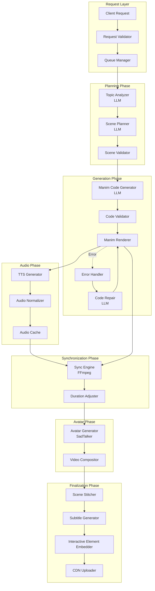
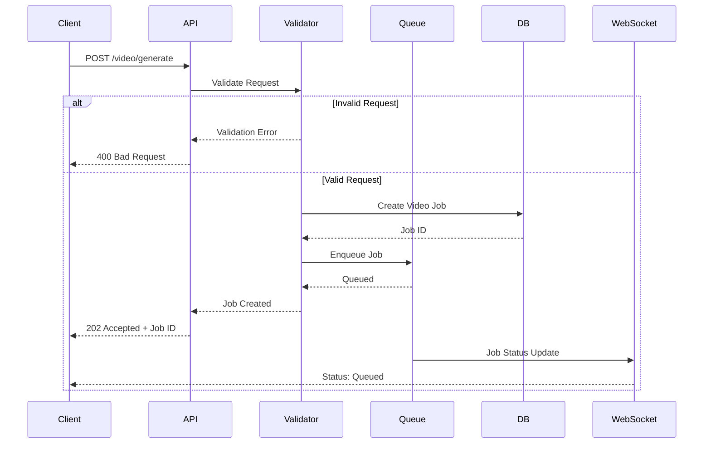
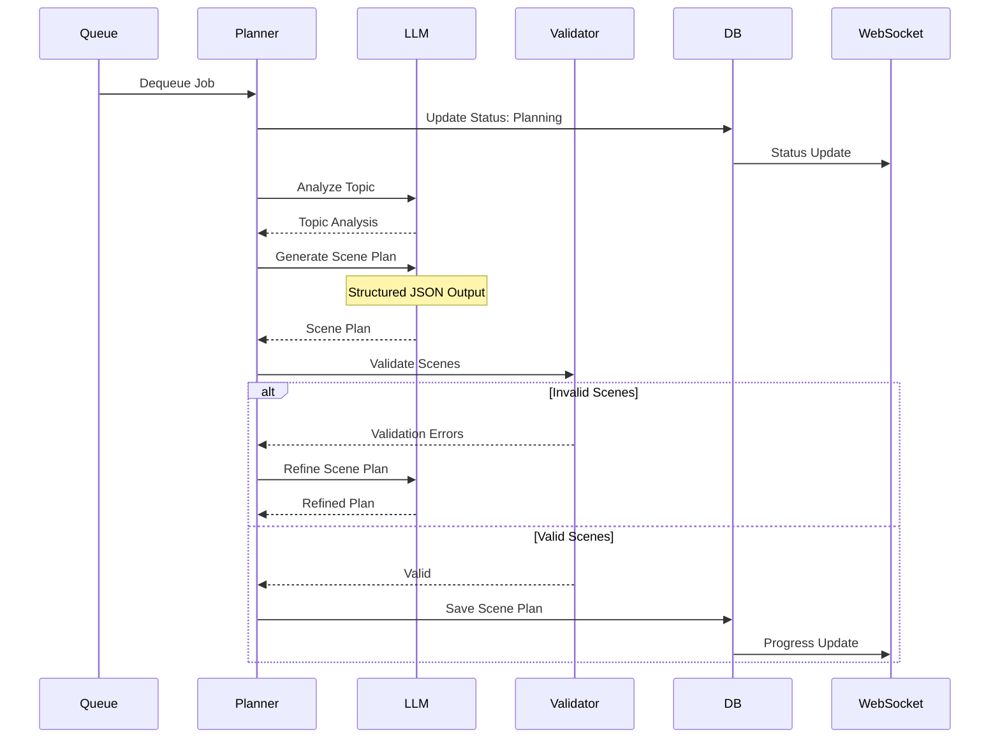
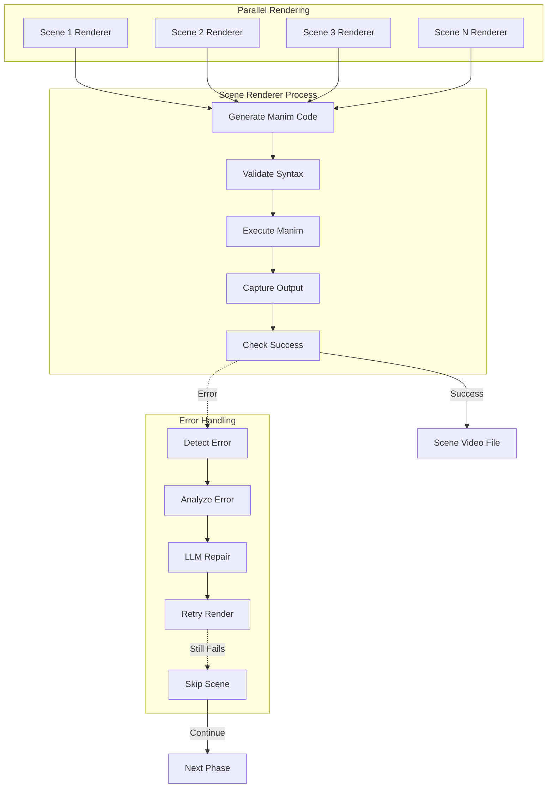
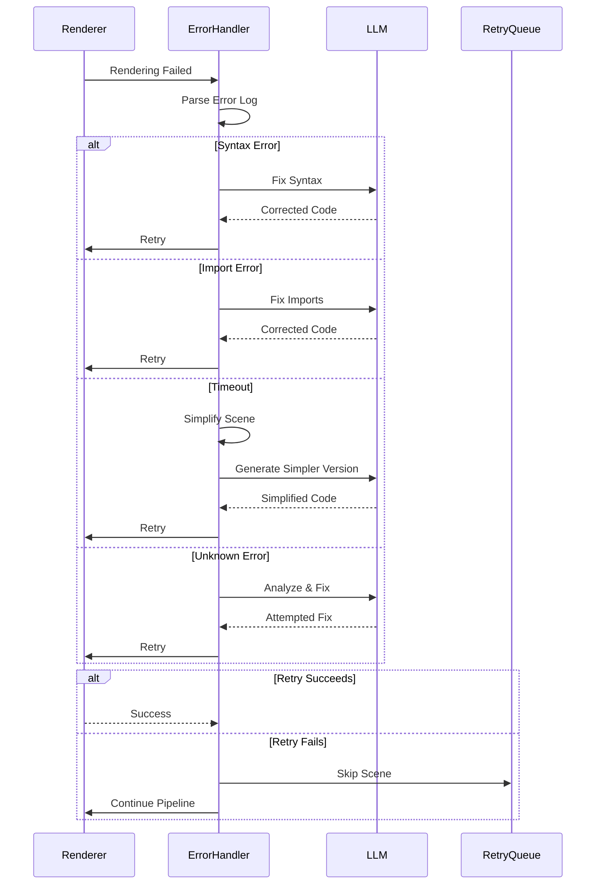
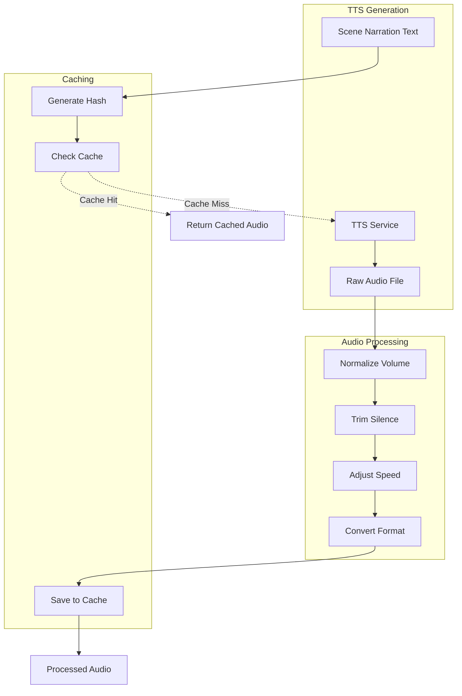
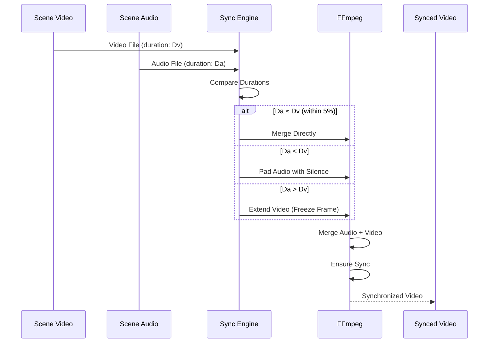

# Video Generation Pipeline - Detailed Design

## Overview

The video generation pipeline is the core feature of Bloop, transforming educational concepts into fully animated, narrated videos with optional talking avatars. This document provides a comprehensive design of the entire pipeline from request to delivery.

## Pipeline Architecture



## Detailed Phase Breakdown

### Phase 1: Request Processing



**Request Validation:**
- Topic/query length: 10-500 characters
- Document size: < 10MB
- Duration: short (30s), medium (2min), long (5min)
- Language: Supported language code
- Avatar image: < 5MB, valid image format

**Job Creation:**
```typescript
interface VideoJob {
  id: string
  userId: string
  status: 'queued' | 'planning' | 'rendering' | 'processing' | 'completed' | 'failed'
  request: VideoGenerationRequest
  progress: number
  estimatedTime: number
  scenes: Scene[]
  errors: Error[]
  createdAt: Date
  updatedAt: Date
}
```

### Phase 2: Scene Planning



**LLM Prompt for Scene Planning:**
```
You are an educational content planner. Given a topic, create a structured scene plan for an animated educational video.

Topic: {topic}
Duration: {duration}
Complexity: {complexity}

Generate a JSON scene plan with the following structure:
{
  "scenes": [
    {
      "id": "scene_1",
      "concept": "Main concept to explain",
      "visualIntent": "What should be shown visually",
      "narration": "What should be said (50-100 words)",
      "duration": 8,
      "manimHints": ["Polygon", "MathTex", "Transform"],
      "dependencies": []
    }
  ]
}

Requirements:
- 3-7 scenes for short, 8-15 for medium, 15-25 for long
- Each scene 5-20 seconds
- Clear progression from simple to complex
- Visual concepts suitable for Manim animation
- Narration matches visual timing
```

**Scene Validation Rules:**
- Scene count within limits
- Duration sum matches target ± 20%
- No circular dependencies
- Manim hints are valid classes
- Narration length appropriate for duration


### Phase 3: Scene Rendering



**Manim Code Generation:**

LLM Prompt:
```
Generate Manim Community Edition code for this scene:

Concept: {concept}
Visual Intent: {visualIntent}
Duration: {duration} seconds
Hints: {manimHints}

Requirements:
- Use Manim Community Edition v0.17+
- Create a Scene class named Scene_{sceneId}
- Duration must be exactly {duration} seconds
- Use self.wait() for timing control
- Include proper imports
- No external file dependencies
- Clean, readable code

Output only the Python code, no explanations.
```

**Generated Code Example:**
```python
from manim import *

class Scene_1(Scene):
    def construct(self):
        # Title
        title = Text("Pythagorean Theorem", font_size=48)
        self.play(Write(title))
        self.wait(1)
        self.play(title.animate.to_edge(UP))
        
        # Triangle
        triangle = Polygon(
            ORIGIN, RIGHT * 3, RIGHT * 3 + UP * 4,
            color=BLUE
        )
        self.play(Create(triangle))
        self.wait(1)
        
        # Labels
        a_label = MathTex("a").next_to(triangle, DOWN)
        b_label = MathTex("b").next_to(triangle, RIGHT)
        c_label = MathTex("c").move_to(triangle.get_center() + LEFT * 1.5 + UP * 2)
        
        self.play(
            Write(a_label),
            Write(b_label),
            Write(c_label)
        )
        self.wait(1)
        
        # Formula
        formula = MathTex("a^2 + b^2 = c^2")
        formula.next_to(triangle, DOWN, buff=1)
        self.play(Write(formula))
        self.wait(2)
```

**Code Validation:**
- Syntax check with Python AST
- Import validation (only allowed libraries)
- Class name matches pattern
- No file I/O operations
- No network operations
- No infinite loops (static analysis)

**Rendering Execution:**
```bash
# Isolated execution environment
docker run --rm \
  --memory=2g \
  --cpus=2 \
  --network=none \
  -v /tmp/scene_code:/code \
  -v /tmp/scene_output:/output \
  manim-renderer:latest \
  manim -ql --format=mp4 --media_dir=/output /code/scene.py Scene_1
```

**Error Detection & Repair:**



**Error Repair Prompt:**
```
The following Manim code failed to render with this error:

Code:
{code}

Error:
{error}

Fix the code to resolve the error. Requirements:
- Maintain the same visual concept
- Keep duration the same
- Use only Manim Community Edition features
- Ensure code is syntactically correct

Output only the corrected Python code.
```

### Phase 4: Audio Generation



**TTS Configuration:**

Azure TTS:
```python
speech_config = speechsdk.SpeechConfig(
    subscription=AZURE_SPEECH_KEY,
    region=AZURE_SPEECH_REGION
)
speech_config.speech_synthesis_voice_name = "en-US-JennyNeural"
speech_config.set_speech_synthesis_output_format(
    speechsdk.SpeechSynthesisOutputFormat.Audio24Khz96KBitRateMonoMp3
)

# SSML for better control
ssml = f"""
<speak version="1.0" xmlns="http://www.w3.org/2001/10/synthesis" xml:lang="en-US">
    <voice name="en-US-JennyNeural">
        <prosody rate="0.9" pitch="+5%">
            {narration_text}
        </prosody>
    </voice>
</speak>
"""
```

ElevenLabs:
```python
response = requests.post(
    f"https://api.elevenlabs.io/v1/text-to-speech/{voice_id}",
    headers={"xi-api-key": ELEVENLABS_API_KEY},
    json={
        "text": narration_text,
        "model_id": "eleven_monolingual_v1",
        "voice_settings": {
            "stability": 0.5,
            "similarity_boost": 0.75
        }
    }
)
```

**Audio Processing Pipeline:**
```python
from pydub import AudioSegment
from pydub.effects import normalize

def process_audio(audio_file: str, target_duration: float) -> str:
    # Load audio
    audio = AudioSegment.from_file(audio_file)
    
    # Normalize volume to -20 dBFS
    audio = normalize(audio, headroom=0.1)
    
    # Trim silence from start and end
    audio = audio.strip_silence(silence_thresh=-40, padding=100)
    
    # Adjust speed to match target duration
    current_duration = len(audio) / 1000.0  # Convert to seconds
    speed_factor = current_duration / target_duration
    
    if 0.8 <= speed_factor <= 1.2:  # Only adjust if within reasonable range
        audio = audio.speedup(playback_speed=speed_factor)
    
    # Export as high-quality MP3
    output_file = f"{audio_file}_processed.mp3"
    audio.export(output_file, format="mp3", bitrate="192k")
    
    return output_file
```

**Audio Caching Strategy:**
```python
def get_cached_audio(narration: str, voice: str, language: str) -> Optional[str]:
    # Generate cache key
    cache_key = hashlib.sha256(
        f"{narration}:{voice}:{language}".encode()
    ).hexdigest()
    
    # Check Redis cache
    cached_url = redis.get(f"audio:cache:{cache_key}")
    if cached_url:
        return cached_url
    
    # Check S3 cache
    s3_key = f"audio-cache/{cache_key}.mp3"
    if s3_client.object_exists(bucket, s3_key):
        url = s3_client.generate_presigned_url(bucket, s3_key)
        redis.setex(f"audio:cache:{cache_key}", 86400, url)  # Cache for 24h
        return url
    
    return None

def cache_audio(narration: str, voice: str, language: str, audio_file: str) -> str:
    cache_key = hashlib.sha256(
        f"{narration}:{voice}:{language}".encode()
    ).hexdigest()
    
    # Upload to S3
    s3_key = f"audio-cache/{cache_key}.mp3"
    s3_client.upload_file(audio_file, bucket, s3_key)
    
    # Generate URL and cache in Redis
    url = s3_client.generate_presigned_url(bucket, s3_key)
    redis.setex(f"audio:cache:{cache_key}", 86400, url)
    
    return url
```

### Phase 5: Audio-Video Synchronization



**FFmpeg Synchronization Commands:**

Direct merge (durations match):
```bash
ffmpeg -i scene_video.mp4 -i scene_audio.mp3 \
  -c:v copy \
  -c:a aac -b:a 192k \
  -shortest \
  output.mp4
```

Pad audio with silence:
```bash
# Calculate padding needed
padding=$(echo "$video_duration - $audio_duration" | bc)

# Add silence to audio
ffmpeg -i scene_audio.mp3 -af "apad=pad_dur=${padding}" padded_audio.mp3

# Merge
ffmpeg -i scene_video.mp4 -i padded_audio.mp3 \
  -c:v copy \
  -c:a aac -b:a 192k \
  output.mp4
```

Extend video with freeze frame:
```bash
# Calculate extension needed
extension=$(echo "$audio_duration - $video_duration" | bc)

# Extract last frame
ffmpeg -sseof -1 -i scene_video.mp4 -update 1 -q:v 1 last_frame.jpg

# Create freeze frame video
ffmpeg -loop 1 -i last_frame.jpg -t ${extension} -pix_fmt yuv420p freeze.mp4

# Concatenate original + freeze
echo "file 'scene_video.mp4'" > concat_list.txt
echo "file 'freeze.mp4'" >> concat_list.txt
ffmpeg -f concat -safe 0 -i concat_list.txt -c copy extended_video.mp4

# Merge with audio
ffmpeg -i extended_video.mp4 -i scene_audio.mp3 \
  -c:v copy \
  -c:a aac -b:a 192k \
  output.mp4
```


### Phase 6: Avatar Generation (Optional)

```mermaid
graph TB
    subgraph "Avatar Input"
        USER_IMAGE[User Avatar Image]
        AUDIO[Complete Audio Track]
    end
    
    subgraph "SadTalker Processing"
        PREPROCESS[Preprocess Image]
        